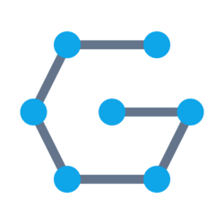
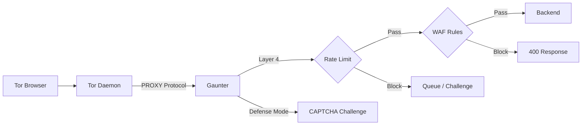

<div align="center">

[](https://git.mrmave.work/maverick/gaunter/actions)
[](LICENSE)
[](https://www.rust-lang.org/)
[](https://hub.docker.com/r/mrmave/gaunter)
[](https://hub.docker.com/r/mrmave/gaunter)
[](https://git.mrmave.work/maverick/gaunter)

<br />


# Gaunter

**Hidden Service Reverse Proxy & Web Application Firewall**

[Explore the docs »](docs/README.md)

[Benchmarks](docs/BENCHMARKS.md) · [Security](docs/SECURITY.md)

</div>

<details>
  <summary>Table of Contents</summary>
  <ol>
    <li><a href="#overview">Overview</a></li>
    <li><a href="#features">Features</a></li>
    <li><a href="#how-it-works">How It Works</a></li>
    <li><a href="#technology-stack">Technology Stack</a></li>
    <li><a href="#quick-start">Quick Start</a></li>
    <li><a href="#configuration">Configuration</a></li>
    <li><a href="#verifying-releases">Verifying Releases</a></li>
    <li><a href="#limitations">Limitations</a></li>
    <li><a href="#license">License</a></li>
  </ol>
</details>

## Overview

Gaunter is a reverse proxy with integrated WAF designed for Tor and I2P hidden services. Built on Cloudflare's **Pingora** framework, it provides **multi-layer protection**:

- **Layer 4 (Transport)**: Connection filtering/dropping for malicious circuits via PROXY protocol
- **Layer 7 (Application)**: Deep HTTP inspection with WAF rules

## Features

### Security
- **Circuit-Based Rate Limiting** — Per-circuit throttling via Tor's PROXY protocol
- **WAF Engine** — SQLi, XSS, Path Traversal, RFI, SSRF detection using [libinjection](https://github.com/libinjection/libinjection) + Aho-Corasick pattern matching
- **No-JS CAPTCHA** — Endgame-style interactive CSS challenge, works in Tor Browser "Safest" mode
- **Automated Defense** — Traffic scoring triggers Defense Mode or Tor PoW based on attack intensity
- **Stateless Sessions** — XChaCha20-Poly1305 encryption, no database required

### Tor & I2P Integration
- **Circuit ID Extraction** — Via `HiddenServiceExportCircuitID haproxy`
- **Active Monitoring** — Uses `stem-rs` to communicate with Tor Control Port for PoW management and circuit observation
- **I2P Support** — Built-in i2pd integration

### Performance
- **Connection Management** — Optimized upstream connection reuse via Pingora's built-in pooling
- **Compression** — Gzip and Brotli support
- **Async I/O** — Built on Tokio runtime

## How It Works



1. **Ingress**: Tor forwards traffic with PROXY header containing circuit ID
2. **Layer 4**: Connection filtering/dropping for malicious circuits before HTTP parsing
3. **Layer 7**: WAF rules inspect headers, body, and query parameters
4. **Decision**: Connection drop (L4), Pass, Challenge (CAPTCHA/PoW), or Block (L7)

## Technology Stack

| Component | Technology |
|-----------|------------|
| Core Framework | [Pingora](https://github.com/cloudflare/pingora) |
| Runtime | [Tokio](https://tokio.rs) |
| Tor Daemon | [Tor](https://www.torproject.org/) `v0.4.9.x` |
| i2pd Daemon | [i2pd](https://i2pd.website/) `v2.59.x` |
| Control Protocol | [stem-rs](https://crates.io/crates/stem-rs) |
| WAF Detection | [libinjection](https://github.com/libinjection/libinjection), Aho-Corasick, RegexSet |
| Session Encryption | XChaCha20-Poly1305 |
| Connection Pool | Built-in Pingora Pooling |
| CAPTCHA | Custom image generation with [ab_glyph](https://crates.io/crates/ab_glyph) |

## Performance

Gaunter is designed for sub-millisecond latency overhead. 

Detailed latency metrics for WAF, Rule Engine, and Session management can be found in the [Benchmarks Documentation](docs/BENCHMARKS.md).

## Quick Start

### Docker (Recommended)

```bash
# Pull image (Docker Hub)
docker pull mrmave/gaunter:latest

# Alternative: Pull from my repository
docker pull git.mrmave.work/maverick/gaunter:latest

# Configure
cp docs/.env.example .env
# Edit .env with your settings

# Run
docker compose up -d
```

### Building from Source

Requires Linux. Tor/i2pd are optional but needed for hidden service integration.

```bash
# 1. Clone
git clone https://git.mrmave.work/maverick/gaunter.git

# Via Tor
git -c http.proxy=socks5h://127.0.0.1:9050 clone http://mavegitwskioz7tpppmjtj7fn24pwezciii3nvc7kdyltn5iu5uakfqd.onion/gaunter

# 2. Build & Run
cd gaunter
cp docs/.env.example .env
cargo build --release
./target/release/gaunter
```

Note: Manual Tor/i2pd setup required if running outside Docker.

## Configuration

Gaunter is configured via environment variables. See the [Configuration Reference](docs/README.md) for all available options.

```bash
cp docs/.env.example .env
```

### Required Variables

| Variable | Description |
|----------|-------------|
| `BACKEND_URL` | Your upstream application URL |
| `SESSION_SECRET` | 32-byte hex key ([generate](docs/README.md#session--captcha)) |
| `CAPTCHA_SECRET` | Random string for token signing |

### Tor Setup

Your `torrc` must enable PROXY protocol:

```text
HiddenServiceDir /var/lib/tor/hidden_service/
HiddenServicePort 80 127.0.0.1:8080
HiddenServiceExportCircuitID haproxy

ControlPort 127.0.0.1:9051
HashedControlPassword 16:YOUR_HASHED_PASSWORD
```

Generate Tor control password:
```bash
tor --hash-password "your_password"
```

## Docker Compose

```yaml
services:
  gaunter:
    image: mrmave/gaunter:latest
    restart: unless-stopped
    env_file:
      - .env
    volumes:
      - ./tor_keys:/var/lib/tor/hidden_service/
      - ./torrc:/etc/tor/torrc:ro
      - ./i2p_keys:/var/lib/i2pd/
```

## Logging

```bash
RUST_LOG=warn           # Production
RUST_LOG=debug          # Development
LOG_FORMAT=json         # Structured output
```

All security events include: `circuit_id`, `http_method`, `http_path`, `action`, `rule`.

## Verifying Releases

Detailed information about dependency audits and fuzzing status can be found in the [Security Documentation](docs/SECURITY.md).

### Docker Image (Cosign)

```bash
wget https://git.mrmave.work/maverick/gaunter/raw/branch/main/certs/cosign.pub
cosign verify --key cosign.pub git.mrmave.work/maverick/gaunter:latest
cosign verify --key cosign.pub mrmave/gaunter:latest
```

### Binary (GPG)

You can download the latest release from the [Releases Page](https://git.mrmave.work/maverick/gaunter/releases/latest).

```bash
# Example for v1.0.2
wget https://git.mrmave.work/maverick/gaunter/releases/download/v1.0.2/gaunter-v1.0.2-linux-amd64
wget https://git.mrmave.work/maverick/gaunter/releases/download/v1.0.2/gaunter-v1.0.2-linux-amd64.sha256
wget https://git.mrmave.work/maverick/gaunter/releases/download/v1.0.2/gaunter-v1.0.2-linux-amd64.asc

# Verify using WKD (Web Key Directory)
gpg --locate-keys mail@mrmave.work

# Or import manually
wget https://git.mrmave.work/maverick/gaunter/raw/branch/main/certs/maverick.asc
gpg --import maverick.asc

sha256sum -c gaunter-v1.0.2-linux-amd64.sha256
gpg --verify gaunter-v1.0.2-linux-amd64.asc gaunter-v1.0.2-linux-amd64
```

Blog post about this project: [https://mrmave.work/blog/gaunter](https://mrmave.work/blog/gaunter)

## Limitations

- **Clustering**: Not supported. Designed for single-instance deployment.
- **File Uploads**: Buffered in memory for inspection. Limits are enforced via `MAX_BODY_SIZE`.

## License

[AGPL-3.0](LICENSE)
